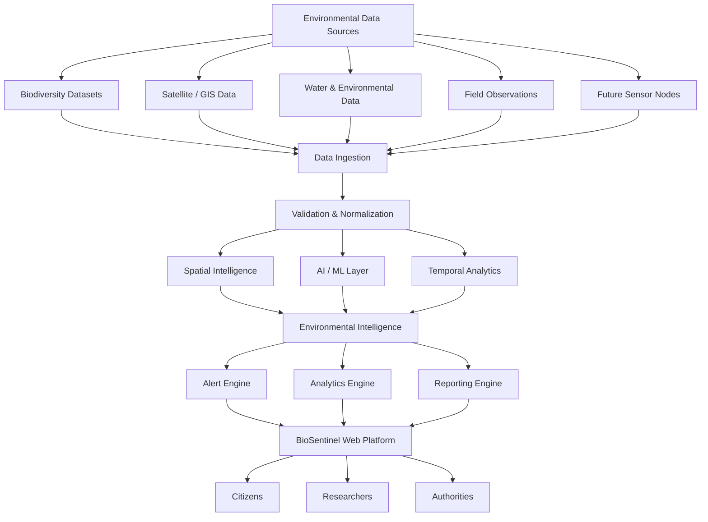
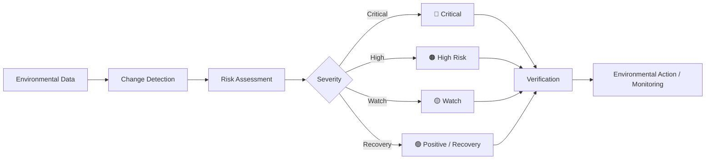
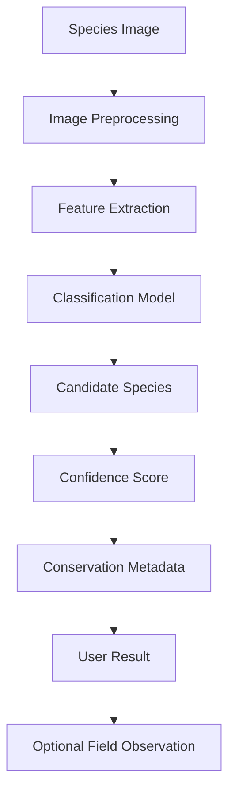
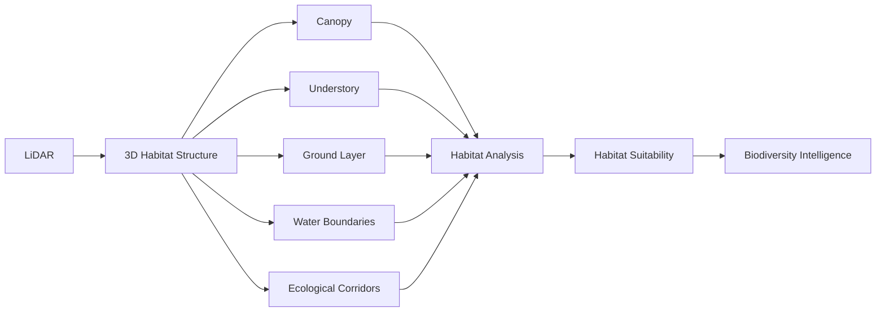
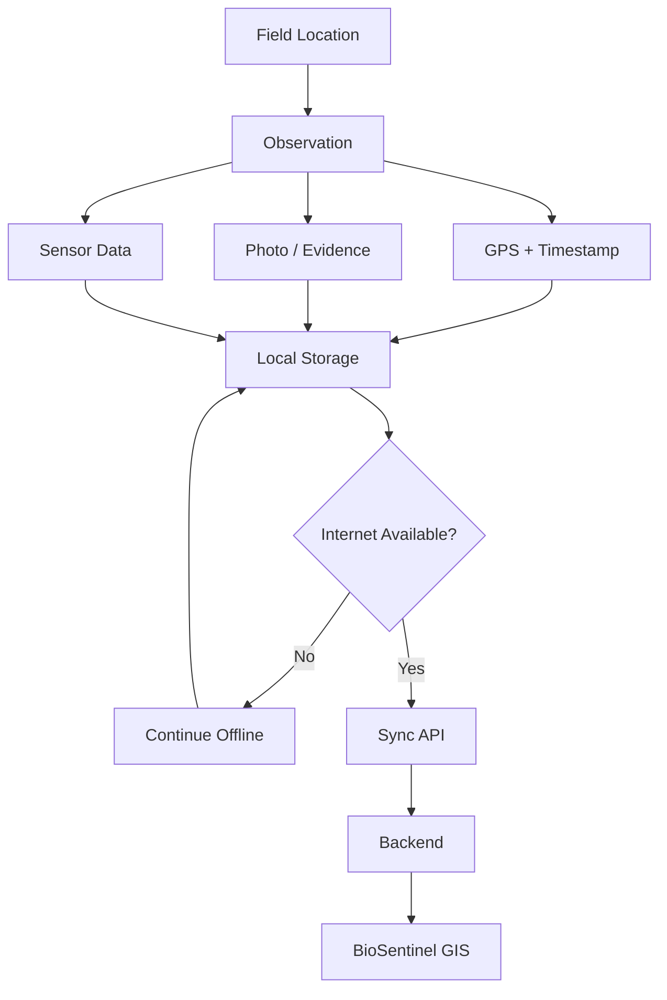
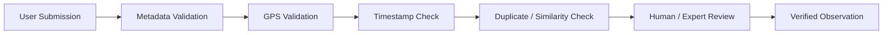
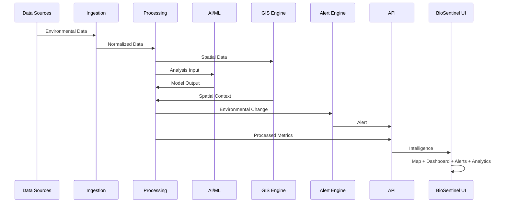

# 🌿 BioSentinel

### **Environmental Intelligence for a Living Planet**

> **Mapping biodiversity. Monitoring ecological change. Connecting field intelligence with spatial data.**

[](#-project-status)
[](#-technology-stack)
[](#-gis--spatial-intelligence)
[](#-ai--ml-layer)
[](#)
[](#)

---

## 🚀 Live Platform

### 🌐 [**Open BioSentinel**](https://biosentinal.netlify.app/)

### 🗺️ [**Open Alert Centre**](https://biosentinal.netlify.app/alerts)

### 💻 [**GitHub Repository**](https://github.com/teambugbusters00/biosentinel-portal)

---

## 🧭 Navigation

<details>
<summary><b>Explore BioSentinel</b></summary>

* [Overview](#-overview)
* [Problem](#-the-problem)
* [Solution](#-the-solution)
* [Core Architecture](#-system-architecture)
* [GIS Intelligence](#-gis--spatial-intelligence)
* [Biodiversity Intelligence](#-biodiversity-intelligence)
* [Alert Engine](#-environmental-alert-engine)
* [AI/ML Layer](#-aiml-layer)
* [Field Intelligence](#-field-intelligence)
* [Citizen Science](#-citizen-science)
* [River Intelligence](#-river-intelligence)
* [Dashboard](#-platform-modules)
* [Technology](#-technology-stack)
* [Data Architecture](#-data-architecture)
* [Roadmap](#-roadmap)
* [Limitations](#-current-limitations)
* [Project Status](#-project-status)

</details>

---

# 🌎 Overview

**BioSentinel** is a spatial environmental intelligence platform designed to monitor and communicate changes in:

* 🦋 Biodiversity
* 🌳 Habitat health
* 🌊 River ecosystems
* 💧 Water quality
* 🌱 Vegetation
* 🌡️ Climate stress
* 🏗️ Human pressure
* 🚨 Ecological risk

Instead of treating biodiversity as a static database, BioSentinel connects:

```text
Biodiversity Data
        +
GIS / Spatial Data
        +
Environmental Indicators
        +
Temporal Change
        +
Field Observations
        +
AI-assisted Analysis
        ↓
Environmental Intelligence
        ↓
Maps + Alerts + Analytics + Reports
```

The long-term objective is to connect **digital biodiversity intelligence with ground-level field observations and physical sensing infrastructure**.

---

# 🎯 The Problem

Environmental information is often fragmented across:

* biodiversity databases
* scientific reports
* satellite datasets
* water monitoring systems
* field observations
* government programmes
* research institutions

A static dataset can tell us:

> **"This species exists here."**

But environmental decision-making needs much more:

> Where is the species now?

> Is its habitat changing?

> Is vegetation declining?

> Is water quality changing?

> Is human pressure increasing?

> Is the change seasonal or long-term?

> Is there field evidence?

> Does the change require an alert?

BioSentinel is designed around these questions.

---

# 💡 The Solution

BioSentinel combines multiple environmental intelligence layers into one platform.

### 1. 🗺️ Spatial Intelligence

Understand environmental conditions by location.

### 2. 🦜 Biodiversity Intelligence

Track species, habitats and ecological indicators.

### 3. 📈 Temporal Intelligence

Compare environmental conditions over time.

### 4. 🚨 Risk Intelligence

Detect and communicate important ecological changes.

### 5. 🤖 AI-assisted Analysis

Assist with species identification and environmental pattern analysis.

### 6. 📱 Field Intelligence

Connect observations collected directly from ecological locations.

### 7. 👥 Citizen Science

Allow communities to contribute observations and evidence.

---

# 🏗️ System Architecture



---

# 🗺️ GIS & Spatial Intelligence

GIS is one of the core components of BioSentinel.

The map is not simply a visual element.

It acts as the **spatial interface for environmental intelligence**.

## Map Layers

| Layer                 | Purpose                   |
| --------------------- | ------------------------- |
| 🦋 Biodiversity       | Biodiversity distribution |
| 🐾 Species            | Species observations      |
| 🌊 Rivers             | River network             |
| 💧 Water Stations     | Water monitoring          |
| 🌳 Habitat            | Habitat health            |
| 🌱 Vegetation         | Vegetation condition      |
| 🏭 Pollution          | Pollution pressure        |
| 🏗️ Human Pressure    | Anthropogenic impact      |
| 🌡️ Climate           | Climate stress            |
| 🚨 Alerts             | Environmental risk        |
| 📍 Field Observations | Ground observations       |
| 🏞️ Protected Areas   | Conservation zones        |

---

## 📍 Spatial Zone Model

BioSentinel uses a multi-scale spatial concept:

```text
                LOCATION
                   │
            ┌──────┴──────┐
            │             │
          500 m          2 km
       MICRO ZONE      LOCAL ZONE
            │             │
            └──────┬──────┘
                   │
                  5 km
          ECOLOGICAL INFLUENCE
                 ZONE
```

This allows the platform to distinguish between:

* immediate local conditions
* surrounding ecological conditions
* broader environmental influence

---

# 🦋 Biodiversity Intelligence

BioSentinel is designed to combine multiple biodiversity indicators.

### Species Indicators

* Species richness
* Species abundance
* Endemism
* Conservation status
* Native / invasive classification
* Indicator species

### Habitat Indicators

* Canopy density
* Understory
* Ground cover
* Water availability
* Habitat fragmentation
* Corridor continuity

### Environmental Stress

* Climate stress
* Human pressure
* Pollution
* Vegetation change
* Water conditions

---

# 🚨 Environmental Alert Engine

BioSentinel converts important environmental changes into structured alerts.



## Alert Categories

### 🔴 Critical

Significant ecological degradation requiring immediate attention.

### 🟠 High Risk

Strong negative change requiring investigation.

### 🟡 Watch

Early warning or developing environmental anomaly.

### 🟢 Recovery

Positive ecological change or recovery signal.

---

# 🔎 Alert Detail

Each alert can contain:

```text
Alert ID
Severity
Location
Detection Time
Last Updated
Environmental Category
Data Source
Confidence
Verification Status
Historical Baseline
Observed Change
Affected Species
Affected Habitat
Evidence
Recommended Action
```

The goal is to move from:

> **"Something changed."**

to:

> **"Something changed here, this is what changed, this is the evidence, this is the possible ecological impact, and this is what should be investigated."**

---

# 🤖 AI / ML Layer

AI is treated as an **assistive intelligence layer**, not a replacement for scientific validation.

## AI-assisted Species Identification



Potential output:

```text
Species:
Indian Pangolin

Scientific Name:
Manis crassicaudata

Confidence:
91%

Habitat:
Dry forest / grassland

Conservation Information:
Available

Threats:
Habitat loss
Human pressure
Road mortality
```

> **Important:** Model confidence must not be represented as scientific certainty.

---

# 🛰️ Change Detection

BioSentinel can support temporal environmental comparison.

```text
Historical Dataset
       +
Current Dataset
       ↓
Spatial Alignment
       ↓
Feature Comparison
       ↓
Change Detection
       ↓
Environmental Interpretation
       ↓
Risk Classification
```

Potential use cases:

* vegetation decline
* habitat fragmentation
* water-body change
* urban expansion
* flood impact
* fire impact
* ecological recovery

---

# 🌳 Habitat Intelligence

Habitat analysis focuses on the physical environment supporting biodiversity.

### Parameters

* Canopy
* Understory
* Ground cover
* Water availability
* Fragmentation
* Connectivity
* Riparian condition
* Ecological corridors

---

# 🛰️ Future LiDAR Integration

BioSentinel's future architecture can incorporate LiDAR-derived ecological structure.



> LiDAR integration should be treated as a future-stage capability unless an actual LiDAR data pipeline is connected.

---

# 🌊 River Intelligence

BioSentinel treats rivers as **ecosystems**, not only water-quality measurements.

```text
River
│
├── Water Quality
├── Biodiversity
├── Riparian Habitat
├── Vegetation
├── Pollution
├── Human Pressure
├── Climate Stress
└── Environmental Alerts
```

For river-focused deployments such as the Ganga ecosystem, the platform can organize monitoring by river segments and ecological zones.

The information architecture is inspired by the broader environmental-programme structure used by India's Namami Gange ecosystem, while BioSentinel maintains its own branding and technical implementation.

Reference:

[Namami Gange — NMCG](https://nmcg.nic.in/NamamiGanga.aspx)

---

# 💧 Water Quality

Potential monitoring parameters include:

* pH
* Dissolved Oxygen
* BOD
* COD
* Turbidity
* Temperature
* Conductivity

Each measurement should ideally retain:

```text
Value
Unit
Timestamp
Location
Monitoring Station
Source
Reference Range
Verification Status
```

> Water-quality thresholds should be sourced from the applicable scientific/regulatory standard rather than arbitrarily hard-coded.

---

# 📱 Field Intelligence

BioSentinel is designed to eventually connect digital intelligence with physical field observations.

A field node can conceptually collect:

* GPS
* timestamp
* biodiversity observation
* environmental signals
* sound observations
* photographs
* manual notes

---

## Offline-first Field Workflow



This is particularly relevant for forests, riverbanks and low-connectivity ecological environments.

---

# 👥 Citizen Science

Citizens can contribute environmental observations.

### Observation Workflow

```text
Citizen
   ↓
Observation
   ↓
Photo
   ↓
GPS
   ↓
Timestamp
   ↓
Submission
   ↓
Verification
   ↓
Environmental Database
```

Potential contribution features:

* observation history
* species contributions
* verified observations
* badges
* challenges
* regional contribution
* community leaderboard

---

# 🔐 Verification Pipeline

Citizen-generated environmental data should not automatically become trusted data.



The system should distinguish:

```text
UNVERIFIED
UNDER REVIEW
VERIFIED
REJECTED
```

---

# 📊 Analytics

BioSentinel provides temporal and spatial analytics.

### Time ranges

* 7 days
* 30 days
* 6 months
* 1 year
* 5 years

### Analytics

* species richness
* species abundance
* habitat health
* water quality
* vegetation
* climate stress
* human pressure
* environmental alerts
* field observations

---

# ⚖️ Location Comparison

Users can compare ecological regions.

Example:

```text
              LOCATION A     LOCATION B

Biodiversity      74             82

Water Health      68             84

Habitat           61             79

Vegetation        72             81

Human Pressure    HIGH           LOW

Climate Stress    MODERATE       LOW
```

Potential outputs:

* comparison chart
* radar chart
* map comparison
* historical trend
* generated report

---

# 🏛️ User Roles

BioSentinel can support role-based experiences.

| Role          | Primary Use           |
| ------------- | --------------------- |
| 👤 Citizen    | Observations & alerts |
| 🔬 Researcher | Data & analytics      |
| 🏛️ Authority | Monitoring & response |
| 🛠️ Admin     | Platform management   |

---

# 🖥️ Platform Modules

| Module                | Purpose                          |
| --------------------- | -------------------------------- |
| 🏠 Home               | Platform overview                |
| 📊 Dashboard          | Environmental command centre     |
| 🗺️ Live Map          | Spatial intelligence             |
| 🦋 Biodiversity       | Species & ecosystem intelligence |
| 🐾 Species            | Species profiles                 |
| 🌊 River Health       | River ecosystem monitoring       |
| 💧 Water Quality      | Water indicators                 |
| 🌳 Habitat            | Habitat intelligence             |
| 🚨 Alerts             | Environmental risk               |
| 🤖 AI Analysis        | AI-assisted analysis             |
| 📍 Field Observations | Ground observations              |
| 📈 Analytics          | Trends & metrics                 |
| ⚖️ Compare            | Regional comparison              |
| 📑 Reports            | Environmental reporting          |
| 👥 Community          | Citizen participation            |
| 🔐 Admin              | Authority management             |

---

# 🧠 Data Architecture

BioSentinel should distinguish between different classes of information.

```text
┌───────────────────────────────────┐
│          DATA SOURCES             │
├───────────────────────────────────┤
│ Biodiversity datasets             │
│ Remote sensing                    │
│ GIS layers                        │
│ Environmental measurements        │
│ Field observations                │
│ Future sensor nodes               │
└───────────────────────────────────┘
                  ↓
┌───────────────────────────────────┐
│       INGESTION & VALIDATION       │
└───────────────────────────────────┘
                  ↓
┌───────────────────────────────────┐
│             DATA LAYER             │
└───────────────────────────────────┘
                  ↓
       ┌──────────┼──────────┐
       ↓          ↓          ↓
      GIS       AI/ML     Analytics
       └──────────┼──────────┘
                  ↓
       Environmental Intelligence
                  ↓
      ┌───────────┼───────────┐
      ↓           ↓           ↓
    Alerts      Maps        Reports
```

---

# 🔬 Data Provenance

Environmental information should retain its provenance.

A production data object should ideally include:

```json
{
  "source": "satellite",
  "timestamp": "2026-09-08T10:30:00Z",
  "location": {
    "latitude": 0,
    "longitude": 0
  },
  "method": "derived",
  "confidence": 0.84,
  "verification_status": "pending"
}
```

This allows the frontend to distinguish:

### 🟢 Verified

Observed / validated information.

### 🟡 Model-derived

Generated through analysis or ML.

### 🔵 Demonstration

Prototype/demo dataset.

### ⚪ Unverified

User-submitted but not yet reviewed.

---

# 🛠️ Technology Stack

> The exact stack should reflect the implementation in the repository. The architecture is designed around a component-based web frontend with GIS, analytics and API integration.

### Frontend

* React
* TypeScript
* Modern CSS / utility-based styling
* Component-based architecture
* Responsive UI

### Visualization

* Interactive maps
* Charts
* Time-series analytics
* Spatial overlays

### Backend / Data Layer

Designed for:

* REST APIs
* environmental datasets
* spatial data
* observations
* alerts
* analytics

### AI/ML

Potential integrations:

* image classification
* species identification
* change detection
* anomaly detection
* environmental risk analysis

---

# 📁 Suggested Project Structure

```text
biosentinel-portal/
│
├── public/
│
├── src/
│   ├── components/
│   │   ├── Navbar/
│   │   ├── Footer/
│   │   ├── AlertCard/
│   │   ├── MetricCard/
│   │   ├── SpeciesCard/
│   │   ├── Map/
│   │   ├── Charts/
│   │   └── Status/
│   │
│   ├── pages/
│   │   ├── Home/
│   │   ├── Dashboard/
│   │   ├── Map/
│   │   ├── Biodiversity/
│   │   ├── Species/
│   │   ├── Rivers/
│   │   ├── Water/
│   │   ├── Habitat/
│   │   ├── Alerts/
│   │   ├── Analytics/
│   │   ├── Community/
│   │   └── Admin/
│   │
│   ├── services/
│   │   ├── api/
│   │   ├── gis/
│   │   └── ai/
│   │
│   ├── data/
│   │
│   ├── hooks/
│   │
│   ├── types/
│   │
│   └── utils/
│
├── README.md
├── package.json
└── ...
```

---

# 🔄 End-to-End Data Flow



---

# 🧪 Prototype Data Philosophy

BioSentinel should never confuse simulated data with real environmental measurements.

The platform distinguishes:

```text
LIVE
MODEL-DERIVED
DEMO
UNVERIFIED
VERIFIED
```

If an external API, satellite feed, sensor or ML model is not connected, the interface should explicitly identify demonstration data.

---

# ⚠️ Scientific & Technical Disclaimer

BioSentinel is an environmental intelligence prototype.

AI-generated outputs, model-derived indicators and demonstration datasets should not be interpreted as verified scientific measurements unless explicitly identified as such.

Environmental decisions should be supported by appropriate scientific validation, authoritative datasets and domain experts.

---

# 🗺️ Roadmap

## Phase 1 — MVP

* [x] Environmental intelligence interface
* [x] Dashboard architecture
* [x] Alert centre
* [x] GIS-oriented interface
* [x] Biodiversity modules
* [x] Environmental analytics
* [x] Responsive frontend

## Phase 2 — Data Integration

* [ ] Real biodiversity datasets
* [ ] Satellite data
* [ ] Water-quality APIs
* [ ] GIS data services
* [ ] Automated data ingestion

## Phase 3 — AI

* [ ] Species image identification
* [ ] Change detection
* [ ] Anomaly detection
* [ ] Environmental risk modelling

## Phase 4 — Field Intelligence

* [ ] GPS field observations
* [ ] Offline-first field application
* [ ] Sensor integration
* [ ] Automatic synchronization

## Phase 5 — Advanced Intelligence

* [ ] LiDAR integration
* [ ] Habitat 3D modelling
* [ ] Predictive biodiversity modelling
* [ ] Ecological corridor analysis
* [ ] Large-scale environmental forecasting

## Phase 6 — Scale

```text
Pilot Region
     ↓
Multiple Regions
     ↓
River Basin
     ↓
National Ecological Network
```

---

# 🏛️ NMCG / Namami Gange Context

BioSentinel can be applied to river ecosystems such as the Ganga by combining:

* river health
* biodiversity
* riparian habitat
* water quality
* pollution
* vegetation
* human pressure
* field observations
* environmental alerts

The official Namami Gange programme provides a useful institutional reference because its environmental programme spans biodiversity conservation, afforestation, pollution/effluent monitoring, public participation and river-related interventions.

**BioSentinel is not affiliated with or an official platform of NMCG unless explicitly stated otherwise.**

Reference:

👉 [National Mission for Clean Ganga](https://nmcg.nic.in/NamamiGanga.aspx)

---

# 🧑‍💻 Development

Clone the repository:

```bash
git clone https://github.com/teambugbusters00/biosentinel-portal.git
cd biosentinel-portal
```

Install dependencies:

```bash
npm install
```

Run development server:

```bash
npm run dev
```

Build:

```bash
npm run build
```

> Use the commands defined by the repository's actual `package.json` if they differ.

---

# 🤝 Contribution

Contributions are welcome.

Potential contribution areas:

* GIS
* Frontend
* Backend
* AI/ML
* Remote sensing
* Biodiversity research
* Data engineering
* Environmental science
* UX/UI
* Documentation

Suggested workflow:

```text
Fork
 ↓
Create Branch
 ↓
Implement
 ↓
Test
 ↓
Pull Request
 ↓
Review
```

---

# 🌱 Why BioSentinel?

Traditional environmental information systems often answer:

> **"What exists?"**

BioSentinel aims to answer:

> **"What exists, where is it, how is it changing, what environmental pressures are associated with that change, and what evidence do we have?"**

That shift — from **static information → environmental intelligence** — is the core idea behind BioSentinel.

---

# 👥 Team

### **Team BUG BUSTERS**

Building technology for biodiversity intelligence, environmental monitoring and ecological awareness.

---

# 📜 Project Status

### 🟠 Prototype / MVP

BioSentinel is currently an evolving prototype.

The architecture is intentionally designed to support future integration of:

* real environmental datasets
* GIS services
* AI/ML models
* remote sensing
* field observations
* physical sensor nodes
* institutional data sources

---

# ⭐ Support the Project

If you find the project interesting:

⭐ Star the repository

🍴 Fork the project

🐛 Open an issue

💡 Suggest an improvement

🤝 Contribute

---

## 🌿 BioSentinel

> **Observe. Understand. Protect.**

**Built by Team BUG BUSTERS**
